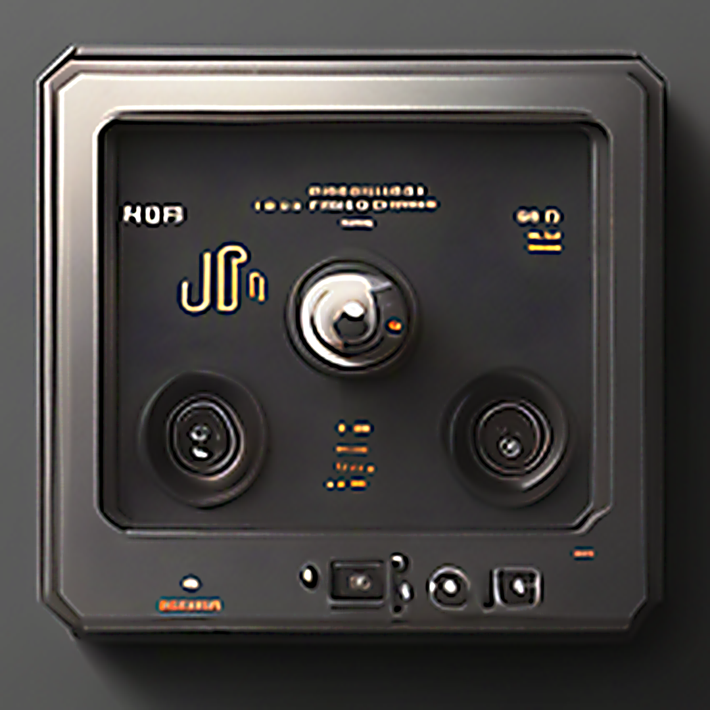
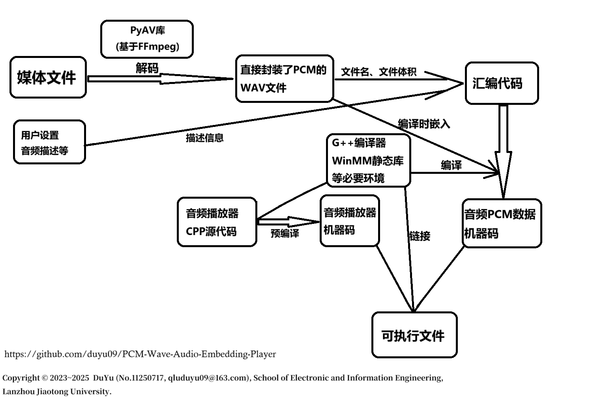

<p align="center">
  <br>
  
</p>
<br>

# PCM Wave Audio Embedding Player

PCM Wave Audio Embedding Player Compilation and Generation Environment (_PAEP_)

## Document Language

[**简体中文**](./README.md) | [**English**](./README.en.md) | [**Tiếng Việt**](./README.vi.md)

## Software Introduction

* **Project Title:** PCM Wave Audio Embedding Player Compilation and Generation Environment, _**PAEP**_ (Chinese: _脉冲音频嵌入播放器编译生成环境_; Vietnamese: _Môi Trường Biên Dịch và Tạo Trình Phát Nhúng Âm Thanh Xung PCM_)
* **Software Language:** Chinese Simplified
* **Operating Platform:** `Windows NT` (Windows 7 and above, **NOT Cross-platform**)
* **Description:** This software packages an audio file (or the audio track of a video) into an executable file that can play the audio directly without relying on any external player.
* **Technical Principle:** Using Python’s `av` library (PyAV), PAEP decodes mainstream audio and video media files into the `wav` format. Based on file metadata and user configurations, it generates assembly code and uses the `g++` compiler to compile both the PCM pulse data and the assembly code into an object file (.o). Then, it links this file with a precompiled audio player object file to produce an executable. Finally, it uses `upx` to compress the executable file and reduce its size.



## Instructions for Use

> ⚠️ **Note:** To optimize the executable file size of the release version, the program itself and its embedded components have been compressed using `UPX` during the build process. Therefore, some antivirus software may mistakenly report it as a virus. Please feel free to ignore such warnings.

Version **PAEP v2.0.0** is fully self-contained and does not depend on any external runtime environment. After downloading the executable file from the release package, you can run it directly.

* **Software release download link:**
  [https://github.com/duyu09/PCM-Wave-Audio-Embedding-Player/releases/download/PAEP_v2.0/paep_v2.0.0_windows_x86-64.exe](https://github.com/duyu09/PCM-Wave-Audio-Embedding-Player/releases/download/PAEP_v2.0/paep_v2.0.0_windows_x86-64.exe)

* **Demonstration File 1:** [DEMO_Quynh-Trang_Phan-Ma-Hong.exe](https://github.com/duyu09/PCM-Wave-Audio-Embedding-Player/releases/download/PAEP_v2.0/DEMO_Quynh-Trang_Phan-Ma-Hong.exe)
  Demonstration file featuring Vietnamese singer **Quỳnh Trang** performing _**Phận Má Hồng**_ (Chinese: _《红颜薄命》_; English: _The Fate of a Beauty_), source: [https://www.youtube.com/watch?v=OJbute1QYvg](https://www.youtube.com/watch?v=OJbute1QYvg)

* **Demonstration File 2:** [DEMO_Quynh-Trang_Duyen-Phan.exe](https://github.com/duyu09/PCM-Wave-Audio-Embedding-Player/releases/download/PAEP_v2.0/DEMO_Quynh-Trang_Duyen-Phan.exe)
  Demonstration file featuring Vietnamese singer **Quỳnh Trang** performing _**Duyên Phận**_ (Chinese: _《缘分》_; English: _Fate_), source: [https://www.youtube.com/watch?v=OJbute1QYvg](https://www.youtube.com/watch?v=OJbute1QYvg)

## Build Instructions

#### 1. Environment Preparation

* Development and build platform: Windows NT operating system (not cross-platform)
* Required Python version: >=3.9
* C/C++ compilation environment: MinGW or similar (recommended: `mingw-w64`; ensure the compiler and toolchain are added to the system `PATH` environment variable).

#### 2. Clone the Source Code

```bash
git clone https://github.com/duyu09/PCM-Wave-Audio-Embedding-Player.git
cd PCM-Wave-Audio-Embedding-Player
```

#### 3. Create a Virtual Environment and Install Dependencies

```bash
python -m venv paep2_env
paep2_env\Scripts\activate
pip install -r requirements.txt
```

#### 4. Build the PAEP Executable File

This step first precompiles the audio player source file `template_cpp.cpp` into an object file, and then uses `Nuitka` to package the Python code into an executable file.

```bash
start build_with_nuitka.bat
```

After the build completes, the executable file `paep_v2.0.0_windows_x86-64.exe` will be generated in the current directory (`PCM-Wave-Audio-Embedding-Player`).

## Software Update Log

* **Update on Jan. 15th, 2024**

  * Created the open-source repository and uploaded all source code for PAEP version 1.0.
* **Update on Oct. 22nd, 2025**

  * Uploaded all source code for PAEP version 2.0, refactored the audio playback module, adopted the PyAV library for media decoding, and optimized the package size and performance.

## Links

* **Lanzhou Jiaotong University** [https://www.lzjtu.edu.cn/](https://www.lzjtu.edu.cn/)
* **School of Electronic and Information Engineering, Lanzhou Jiaotong University** [https://dxxy.lzjtu.edu.cn/](https://dxxy.lzjtu.edu.cn/)
* **Faculty of Computer Science and Technology, Qilu University of Technology (Shandong Academy of Sciences)** [http://jsxb.scsc.cn/](http://jsxb.scsc.cn/)
* **Shandong Computer Science Center (National Supercomputing Center in Jinan)** [https://www.nsccjn.cn/](https://www.nsccjn.cn/)
* **Du Yu’s Research Group Page** [https://faculty.lzjtu.edu.cn/chenmei/zh_CN/xsxx/2554/content/1837.htm](https://faculty.lzjtu.edu.cn/chenmei/zh_CN/xsxx/2554/content/1837.htm)
* **Du Yu’s GitHub Page** [https://github.com/duyu09/](https://github.com/duyu09/)

## Copyright Notice

* Copyright © 2023–2025 **Du Yu** (Chinese: *杜宇*; Vietnamese: *Đỗ Vũ*; @Duyu09, [qluduyu09@163.com](mailto:qluduyu09@163.com)),
  **School of Electronic and Information Engineering, Lanzhou Jiaotong University** (Chinese: *兰州交通大学电子与信息工程学院*; Vietnamese: *Đại Học Giao Thông Lan Châu, Học Viện Điện Tử và Công Nghệ Thông Tin*).
* The software logo was originally generated by Baidu’s “Wenxin Yiyan” (`ERNIE Bot`) and later modified. This is hereby acknowledged.

> **Hold Original Intent, Stay Steadfast in Direction!**
>
> 
