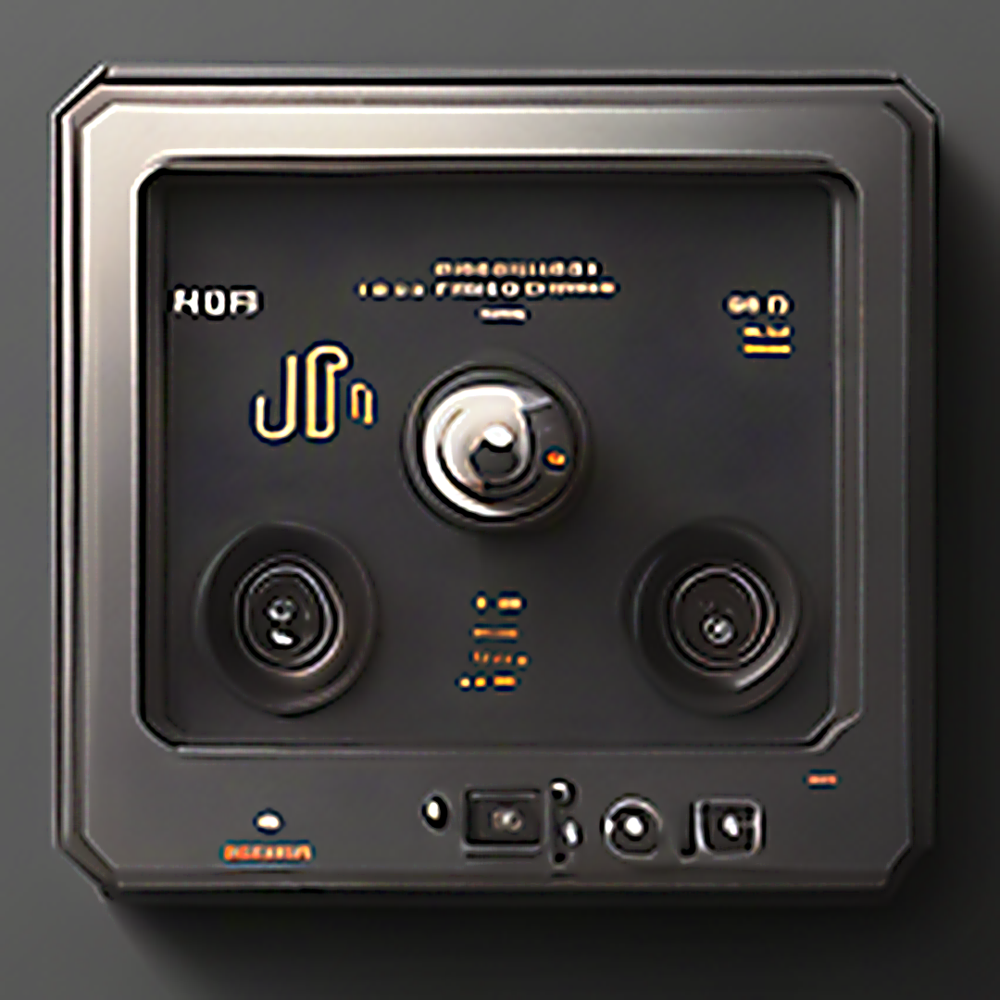
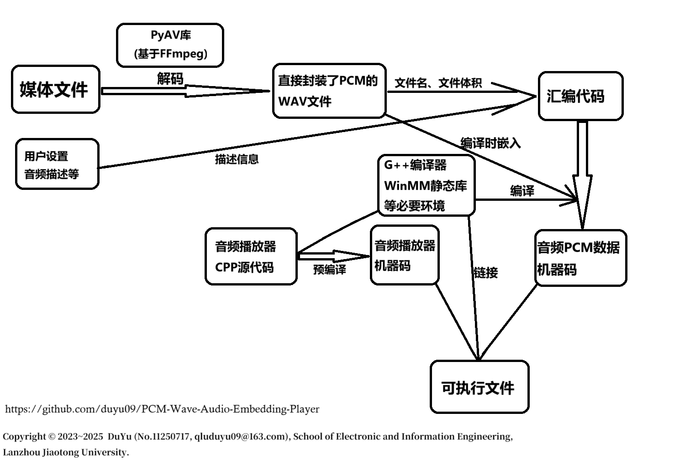

<p align="center">
  <br>
  
</p>
<br>

# PCM Wave Audio Embedding Player

音频嵌入播放器(PAEP)编译生成环境

## 软件简介

- 软件中文名称：音频嵌入播放器(PAEP)编译生成环境
- 软件英文名称：PCM Wave Audio Embedding Player Compilation and Generation Environment. (_PAEP_)
- 截至目前的最新版本：`v2.0.0`
- 软件语言：中文
- 软件运行平台：`Windows NT` (Windows 7 及以上，**不跨平台**)
- 简介：本软件功能是：将音频(或视频中的音频)“打包”为可执行文件，不依赖任何外部播放器即可播放音频。
- 原理介绍：采用python的`av`库（PyAV），将主流格式的音频与视频媒体文件解码为`wav`格式，根据文件的信息以及用户的相关设置，生成汇编代码，并使用`g++`编译器，将音频的PCM脉冲数据与汇编代码共同编译为目标机器码文件(.o文件)，然后将预编译的音频播放器(.o目标文件)与其进行链接，生成可执行文件。最后利用`upx`将生成的可执行文件压缩，减小文件体积。



## 著作权声明

- Copyright © 2023~2025 DuYu (@Duyu09, qluduyu09@163.com), School of Electronic and Information Engineering, Lanzhou Jiaotong University.
- 本软件的Logo由百度的文心一言生成，后期有修改。特此声明。

## 运行说明

v2.0.0版本的PAEP软件无需依赖任何外部环境，下载发行版可执行文件后，直接运行即可。发行版下载地址：https://github.com/duyu09/PCM-Wave-Audio-Embedding-Player/releases/download/PAEP_v2.0/paep_v2.0.0_windows_x86-64.exe

## 自行构建步骤

#### 1. 环境准备

- 开发及编译、构建平台：Windows NT操作系统，不跨平台。
- Python版本要求：>=3.9
- C/C++编译环境：MinGW等 (推荐使用`mingw-w64`，确保编译器等工具链在系统`PATH`环境变量中)。

#### 2. 克隆源代码

```bash
git clone https://github.com/duyu09/PCM-Wave-Audio-Embedding-Player.git
cd PCM-Wave-Audio-Embedding-Player
```

#### 3. 创建虚拟环境并安装依赖库

```bash
python -m venv paep2_env
paep2_env\Scripts\activate
pip install -r requirements.txt
```

#### 4. 构建PAEP可执行文件

这一步首先将音频播放器源代码`template_cpp.cpp`预编译为目标文件，然后使用`Nuitka`将Python代码打包为可执行文件。

```bash
start build_with_nuitka.bat
```

运行结束后，会在当前目录下（`PCM-Wave-Audio-Embedding-Player`）生成可执行文件`paep_v2.0.0_windows_x86-64.exe`。

## 软件更新日志

- Update on Jan. 15th, 2024
  - 创建开源代码仓库，提交PAEP软件v1.0版本的全部代码。
- Update on Oct. 22th, 2025
  - 提交PAEP软件v2.0版本的全部代码，重构音频播放模块；采用PyAV库解码用户输入的媒体文件；优化项目打包的体积与性能。
 
## 友情链接

- 兰州交通大学 https://www.lzjtu.edu.cn/
- 兰州交通大学电子与信息工程学院 https://dxxy.lzjtu.edu.cn/
- 齐鲁工业大学 (山东省科学院) 计算机科学与技术学部 http://jsxb.scsc.cn/
- 山东省计算中心 (国家超级计算济南中心) https://www.nsccjn.cn/
- DuYu的课题组主页 https://faculty.lzjtu.edu.cn/chenmei/zh_CN/xsxx/2554/content/1837.htm
- DuYu的GitHub网站 https://github.com/duyu09/

> GIỮ VỮNG TÂM ĐẦU, KIÊN ĐỊNH CHÍ HƯỚNG
