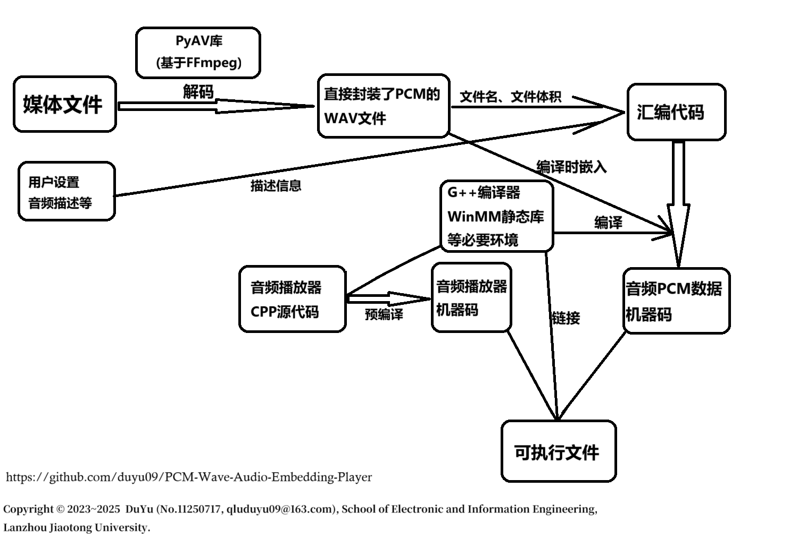

<p align="center">
  <br>
  
</p>
<br>

# Trình Phát Nhúng Âm Thanh Dạng Sóng PCM

Môi Trường Biên Dịch và Tạo Trình Phát Nhúng Âm Thanh Xung PCM (_PAEP_)

## Ngôn Ngữ Tài Liệu

[**简体中文**](./README.md) | [**English**](./README.en.md) | [**Tiếng Việt**](./README.vi.md)

## Giới Thiệu Phần Mềm

* Môi Trường Biên Dịch và Tạo Trình Phát Nhúng Âm Thanh Xung PCM (Tiếng Trung: _脉冲音频嵌入播放器编译生成环境_; Tiếng Anh: _PCM Wave Audio Embedding Player Compilation and Generation Environment, **PAEP**_)
* Ngôn ngữ phần mềm: Tiếng Trung Giản Thể
* Nền tảng hoạt động: `Windows NT` (Windows 7 trở lên, **không đa nền tảng**)
* Giới thiệu: Chức năng của phần mềm này là “đóng gói” âm thanh (hoặc âm thanh trong video) thành tệp thực thi, có thể phát âm thanh mà **không cần bất kỳ trình phát bên ngoài nào**.
* Nguyên lý hoạt động: Sử dụng thư viện `av` của Python (PyAV), phần mềm sẽ giải mã tệp âm thanh hoặc video phổ biến sang định dạng `wav`. Dựa trên thông tin tệp và cài đặt của người dùng, chương trình sẽ sinh mã hợp ngữ, sau đó sử dụng trình biên dịch `g++` để biên dịch dữ liệu xung PCM của âm thanh cùng mã hợp ngữ thành tệp mã máy đích (.o). Cuối cùng, phần mềm sẽ liên kết tệp mục tiêu của trình phát âm thanh đã được biên dịch trước (.o) để tạo ra tệp thực thi, và sử dụng `upx` để nén tệp nhằm giảm dung lượng.



## Hướng Dẫn Chạy Phần Mềm

> ⚠️ **Lưu ý:** Để tối ưu kích thước của tệp thực thi trong bản phát hành, chương trình và các thành phần nhúng bên trong đã được nén bằng công cụ `UPX` trong quá trình biên dịch. Do đó, một số phần mềm diệt virus có thể nhận nhầm là có mã độc. Bạn có thể yên tâm bỏ qua cảnh báo này.

Phiên bản **PAEP v2.0.0** không cần bất kỳ môi trường phụ thuộc nào khác. Sau khi tải về tệp thực thi trong bản phát hành, bạn có thể chạy trực tiếp.

* **Liên kết tải bản phát hành phần mềm:**
  [https://github.com/duyu09/PCM-Wave-Audio-Embedding-Player/releases/download/PAEP_v2.0/paep_v2.0.0_windows_x86-64.exe](https://github.com/duyu09/PCM-Wave-Audio-Embedding-Player/releases/download/PAEP_v2.0/paep_v2.0.0_windows_x86-64.exe)

* **Tệp mẫu 1:** [DEMO_Quynh-Trang_Phan-Ma-Hong.exe](https://github.com/duyu09/PCM-Wave-Audio-Embedding-Player/releases/download/PAEP_v2.0/DEMO_Quynh-Trang_Phan-Ma-Hong.exe) Tệp minh họa, ca sĩ Việt Nam **Quỳnh Trang** với bài hát _Phận Má Hồng_ (Tiếng Trung: _《红颜薄命》_; Tiếng Anh: _The Fate of a Beauty_), nguồn: [https://www.youtube.com/watch?v=OJbute1QYvg](https://www.youtube.com/watch?v=OJbute1QYvg)

* **Tệp mẫu 2:** [DEMO_Quynh-Trang_Duyen-Phan.exe](https://github.com/duyu09/PCM-Wave-Audio-Embedding-Player/releases/download/PAEP_v2.0/DEMO_Quynh-Trang_Duyen-Phan.exe) Tệp minh họa, ca sĩ Việt Nam **Quỳnh Trang** với bài hát _Duyên Phận_ (Tiếng Trung: _《缘分》_; Tiếng Anh: _Fate_), nguồn: [https://www.youtube.com/watch?v=OJbute1QYvg](https://www.youtube.com/watch?v=OJbute1QYvg)

## Các Bước Tự Xây Dựng

#### 1. Chuẩn Bị Môi Trường

* Nền tảng phát triển và biên dịch: hệ điều hành Windows NT, **không đa nền tảng**.
* Phiên bản Python yêu cầu: >=3.9
* Môi trường biên dịch C/C++: MinGW hoặc tương đương (khuyến nghị sử dụng `mingw-w64`, đảm bảo rằng chuỗi công cụ đã được thêm vào biến môi trường `PATH` của hệ thống).

#### 2. Sao Chép Mã Nguồn

```bash
git clone https://github.com/duyu09/PCM-Wave-Audio-Embedding-Player.git
cd PCM-Wave-Audio-Embedding-Player
```

#### 3. Tạo Môi Trường Ảo và Cài Đặt Thư Viện Phụ Thuộc

```bash
python -m venv paep2_env
paep2_env\Scripts\activate
pip install -r requirements.txt
```

#### 4. Xây Dựng Tệp Thực Thi PAEP

Bước này đầu tiên sẽ biên dịch trước mã nguồn của trình phát âm thanh `template_cpp.cpp` thành tệp đối tượng (.o), sau đó sử dụng `Nuitka` để đóng gói mã Python thành tệp thực thi.

```bash
start build_with_nuitka.bat
```

Sau khi hoàn tất, trong thư mục hiện tại (`PCM-Wave-Audio-Embedding-Player`) sẽ tạo ra tệp thực thi `paep_v2.0.0_windows_x86-64.exe`.

## Nhật Ký Cập Nhật Phần Mềm

* **Cập nhật ngày 15 tháng 1 năm 2024**

  * Tạo kho mã nguồn mở và đăng tải toàn bộ mã của phiên bản PAEP v1.0.
* **Cập nhật ngày 22 tháng 10 năm 2025**

  * Đăng tải toàn bộ mã nguồn của phiên bản PAEP v2.0, tái cấu trúc mô-đun phát âm thanh; sử dụng thư viện PyAV để giải mã tệp phương tiện đầu vào của người dùng; tối ưu hóa dung lượng và hiệu suất khi đóng gói dự án.

## Liên Kết

* **Đại Học Giao Thông Lan Châu** [https://www.lzjtu.edu.cn/](https://www.lzjtu.edu.cn/)
* **Đại Học Giao Thông Lan Châu, Học Viện Điện Tử và Công Nghệ Thông Tin** [https://dxxy.lzjtu.edu.cn/](https://dxxy.lzjtu.edu.cn/)
* **Đại học Công nghiệp Tề Lỗ (Viện Khoa học tỉnh Sơn Đông), Học bộ Khoa học và Kỹ thuật Máy tính** [http://jsxb.scsc.cn/](http://jsxb.scsc.cn/)
* **Trung Tâm Tính Toán Tỉnh Sơn Đông (Trung tâm Tính toán Siêu máy tính Quốc gia Tế Nam)** [https://www.nsccjn.cn/](https://www.nsccjn.cn/)
* **Trang chủ của Đỗ Vũ tại nhóm nghiên cứu** [https://faculty.lzjtu.edu.cn/chenmei/zh_CN/xsxx/2554/content/1837.htm](https://faculty.lzjtu.edu.cn/chenmei/zh_CN/xsxx/2554/content/1837.htm)
* **Trang GitHub của Đỗ Vũ** [https://github.com/duyu09/](https://github.com/duyu09/)

## Tuyên Bố Bản Quyền

* Bản quyền © 2023~2025 **Đỗ Vũ** (Tiếng Trung: *杜宇*; Tiếng Anh: *Du Yu*; @duyu09, Email: [qluduyu09@163.com](mailto:qluduyu09@163.com)),
  Đại Học Giao Thông Lan Châu, Học Viện Điện Tử và Công Nghệ Thông Tin (Tiếng Trung: *兰州交通大学电子与信息工程学院*; Tiếng Anh: *School of Electronic and Information Engineering, Lanzhou Jiaotong University*)

* Logo của phần mềm này được tạo bởi **Văn Tâm Nhất Ngôn** (Tiếng Trung: _文心一言_; Tiếng Anh: _ERNIE_), sau đó được chỉnh sửa lại. Xin trân trọng tuyên bố.

> **GIỮ VỮNG TÂM ĐẦU, KIÊN ĐỊNH CHÍ HƯỚNG**
>
> 
